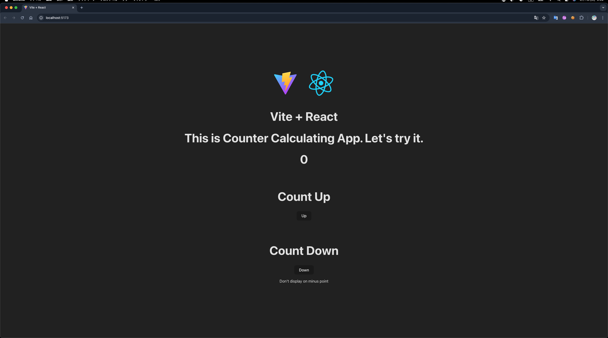

# Counter Calculating App
## Usage
- clone this repository
`git clone https://github.com/daitenn/demo-spa.git`
- install this directory as `node_modelus`
`npm install`
- start to localhost
`npm run dev`

## Display
- 